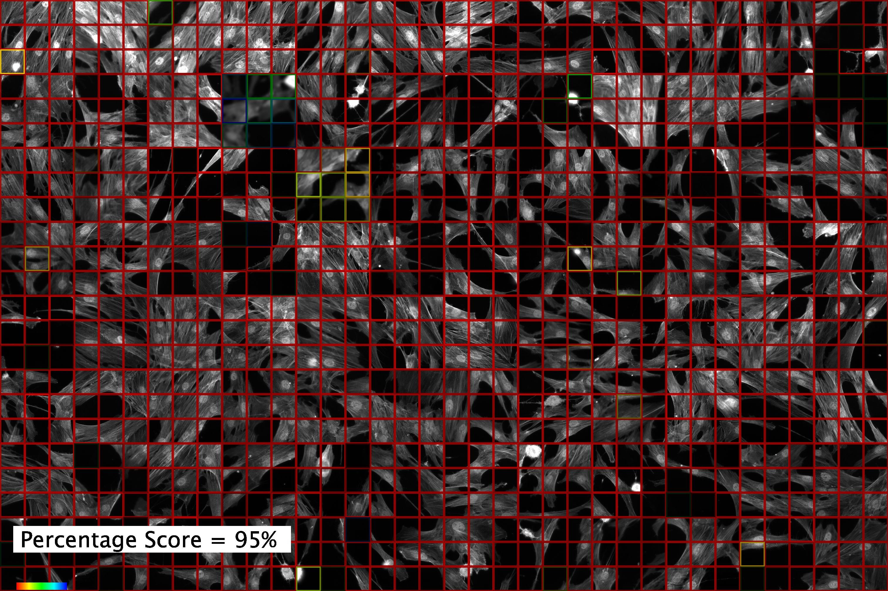

# Near Real-Time Image Analysis Macro
Oftentimes in high content imaging applications, large numbers (i.e. up to 1 terabyte) of microscopy images may be acquired from each of the many "wells" in a microtiter plate (e.g. a 96-well plate) using automated microscopy. However, it's challenging to manually inspect, either exhaustively, or with spot checking, the quality of such image datasets in near real-time while the well plate could still practically be re-imaged.

In previous work, we developed a [Microscope Image Focus Quality Classifier](https://github.com/google/microscopeimagequality) and corresponding [plugin for Fiji](https://imagej.net/Microscope_Focus_Quality), which uses a pre-trained deep neural network to rate the focus quality of each 84x84 pixel crop of a single microscope image. This analysis macro is an extension of that work, enabling this model to rate the focus quality of randomly sampled crops from a larger image dataset.

This macro can generate whole-plate montages per channel for inspecting image quality, where random image crops are sampled from each well on a well plate. A colored annotation added as a border around each crop denotes the focus quality, as rated by the that this macro utilizes. The macro can generate representative montages for 1 terabyte of images in just 30 minutes.

### Example output

### Example set of input images
A sample dataset to test the macro can be found [here (300MB)](https://storage.googleapis.com/nyscfgas/nyscf3_data_sources_external/TestDataSet2Channels.zip).

### Requirements
This Fiji (ImageJ) macro requires both [Fiji](https://imagej.net/Fiji) and the [Microscope Image Focus Quality Classifier](https://imagej.net/Microscope_Focus_Quality) plugin.

Input images must live in a single directory.
### Getting started
#### Installing Microscope Image Focus Quality Classifier
Please see directions [here](https://imagej.net/Microscope_Focus_Quality.html#Installation).

#### Setting up and opening Macro
1. Download macro and save to “macros” folder in Fiji.app folder.
1. Open Fiji
1. Go to “Plugins” tab
   1. Go to “Macros” > “Edit”
   1. Select macro .ijm file

### Running macro
At the top of the macro, there are variables that can be changed to suit your experiment.

Before running the macro, please make sure that the variables are correct.

Once you have verified the variables, hit “Run”. The first window to pop-up will state the requirements and assumptions of the macro.

The next window will ask for the path to the directory of your data, the total number of sites to select from, if you want to only do a focus analysis, and if there are empty wells

If you do not select the box to only analyze focus, a window will appear which asks what channels you’d like to output an intensity montage. This list is based off of the channel list stated in the variables at the top of the code. If you choose to only analyze focus, this window will not appear.

If you do select the box stating there are empty wells, a window will appear which allows you to choose what well to analyze. This list is based off of the row and column arrays stated in the variables at the top of the code.

